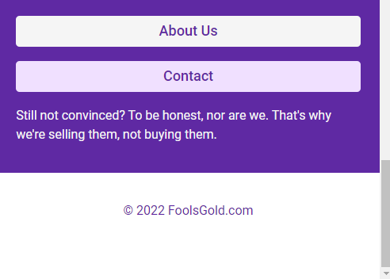

# NFT Site

> A simple site for selling NFT shoes which is adorable and wonderful.

## ScreenShots

### _Mobile Version_




### _Desktop Version_


## Quick start:

1. _npm_

```
$ npm install
$ npm start
$ npm run dev
```

2. _pnpm_

```
$ pnpm install
$ pnpm start
$ pnpm run dev
```

Head over to https://vitejs.dev/ to learn more about using vite


## For cloning the project 🪛

```
# Clone this repository
$ gh repo clone MastooraTurkmen/NFT-Site

# Go inside the repository
$ cd nft-site
```


-----


## Languages and Tools are used

1. **Languages**
    + [HTML](https://github.com/topics/html)
    + [HTML5](https://github.com/topics/html5)
    + [CSS](https://github.com/topics/css)
    + [CSS3](https://github.com/topics/css3)
    + [JavaScript](https://github.com/topics/javascript)

2. **Tools** 
    + [Chrome](https://github.com/topics/chrome)
    + [VSCode](https://github.com/topics/vscode)
    + [Figma](https://github.com/topics/figma)
    + [Netlify](https://github.com/topics/netlify)


-----


## Deployment📥
1. How to deploy our project to netlify site?
2. I use [Netlify App](https://app.netlify.com/) for deploying my projects.
3. Go to Netlify site and select Add a new site.
4. From there select **_Deploy with Github_**.
5. Then write your project name and select it.
6. After selecting here you can see that the project **_Review configuration for NFT-Site_** and then select the **_Deploy NFT-Site_** Button.
7. Now your project is Live.


